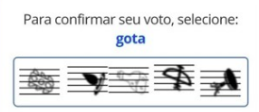

## Captcha Challange

Este repositório tem o intuito de refinar um script de verificação de autenticidade mediante captchas de imagens utilizando Python.

## Metas 

* Aprimorar/Diversificar Dataset

* Ligar/Mesclar Contornos Próximos 

* Gravar Coordenadas de elementos para click

* Estruturar Dataset de Elementos por características

* Modularizar e Aplicar as boas práticas 

## Depêndencias
* [Python3](https://www.python.org/)

* [OpenCV2](https://answers.opencv.org/questions/)

* [Selenium](https://www.seleniumhq.org/)

* [Numpy](https://numpy.org/install/)

* [Matplot](https://matplotlib.org/3.1.1/users/installing.html)

## Modelo 
Este modelo de verificação em específico foi utiliado como template de votação:  
&nbsp;&nbsp;&nbsp;&nbsp;&nbsp;&nbsp;&nbsp;&nbsp;&nbsp;&nbsp;&nbsp;&nbsp;&nbsp;&nbsp;&nbsp;&nbsp;&nbsp;&nbsp;&nbsp;&nbsp;&nbsp;&nbsp;&nbsp;&nbsp;&nbsp;&nbsp;&nbsp;&nbsp;&nbsp;&nbsp;&nbsp;&nbsp;&nbsp;&nbsp;&nbsp;&nbsp;&nbsp;&nbsp;&nbsp;&nbsp;
&nbsp;&nbsp;&nbsp;&nbsp;  
Onde o usuário deveria identificar na imagem qual a ***posição/coordenadas*** correta da figura requisitada(gota).  Para determinado usuário realizar um grande número de votaçõe todo este trabalho manual é necessário. Eventualmente,torna-se cansativo esta burocracia para concluir a tarefa. A proposta desse script seria tentar automatizar este processo de votação e identificação de ícones.

## Resumo e Objetivos
* Criar um script de votações que atenda o modelo proposto;

* Identificar e organizar os elementos dos captchas;

* Ampliar Dataset de Testes;

* Utilizar webdriver para simular o processo de votação;

* Esperar o próximo BBB pra ver se funciona mesmo.

## Referências

> https://github.com/izmcm/BBBot 

> https://pypi.org/project/opencv-python/

